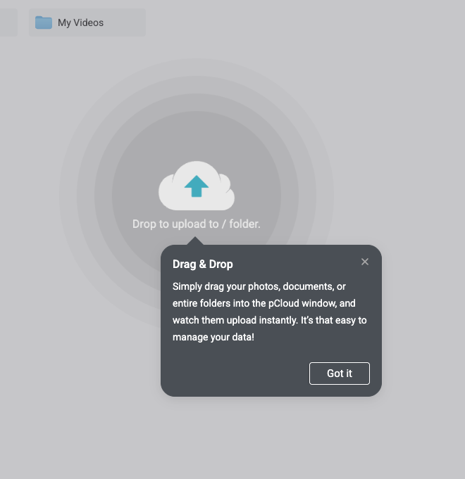
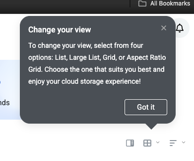

# F120 — Onboarding

> Guided product tour from webhouse.app landing to first published content — tooltip-style walkthrough with progressive disclosure.

## Problem

New users who land on webhouse.app or install @webhouse/cms locally face a blank admin UI with no guidance. The sidebar has 15+ menu items, the editor has multiple panels, and features like Chat, AI agents, SEO scoring, and MCP are invisible until discovered by accident. First-time users don't know where to start, what to click, or what the product can do.

There's no bridge between the marketing site (webhouse.app) and the productive admin UI. Users fall off between "this looks cool" and "I published my first page."

## Solution

A tooltip-style guided walkthrough (similar to pCloud's onboarding — see `docs/features/ref/onboarding-ref-*.png`) that activates on first login and guides users through key features with contextual, dismissable tooltip popups. Two distinct paths based on how the user arrives:

1. **Hub path** — sign up on webhouse.app → create first site → guided tour of admin
2. **Self-hosted path** — clone/install → first `npx cms dev` → guided tour of admin

Both paths converge at the admin UI tour. Progressive disclosure: don't show everything at once — reveal features as the user reaches natural milestones.

## Reference Design




Key design elements from reference:
- **Dark tooltip card** with rounded corners, positioned near the target element
- **Title + description** — short, actionable text
- **"Got it" button** — single CTA to advance
- **× close** — skip this tip
- **Subtle backdrop** — slightly dim the rest of the UI to draw focus
- **Arrow/pointer** — connects tooltip to target element

## Technical Design

### 1. Onboarding State (UserState extension)

```typescript
// lib/user-state.ts — add to UserState interface
export interface OnboardingState {
  /** Has user completed the main tour? */
  tourCompleted: boolean;
  /** Which steps have been seen/dismissed */
  completedSteps: string[];
  /** Current active tour (null = no tour running) */
  activeTour: string | null;
  /** Timestamp of first login */
  firstLoginAt: string | null;
  /** Which path: 'hub' | 'selfhosted' | null */
  onboardingPath: "hub" | "selfhosted" | null;
}

// Add to UserState:
export interface UserState {
  // ... existing fields ...
  onboarding: OnboardingState;
}
```

### 2. Tour Definitions

```typescript
// lib/onboarding/tours.ts

export interface TourStep {
  id: string;
  /** CSS selector or data-testid to anchor the tooltip */
  target: string;
  /** Tooltip title */
  title: string;
  titleDa: string;
  /** Tooltip body text */
  body: string;
  bodyDa: string;
  /** Position relative to target */
  placement: "top" | "bottom" | "left" | "right";
  /** Optional: URL to navigate to before showing this step */
  navigateTo?: string;
  /** Optional: wait for this element before showing */
  waitFor?: string;
  /** Optional: highlight a specific area */
  spotlightPadding?: number;
}

export interface Tour {
  id: string;
  name: string;
  steps: TourStep[];
  /** Show this tour when condition is met */
  trigger: "first-login" | "first-site-created" | "manual";
}
```

### 3. Tour: Welcome Tour (first login)

```typescript
const WELCOME_TOUR: Tour = {
  id: "welcome",
  name: "Welcome to webhouse.app",
  trigger: "first-login",
  steps: [
    {
      id: "welcome-dashboard",
      target: '[data-testid="sidebar-dashboard"]',
      title: "Welcome to your Dashboard",
      titleDa: "Velkommen til dit Dashboard",
      body: "This is your command center. See content stats, recent activity, and quick actions at a glance.",
      bodyDa: "Dette er dit kontrolcenter. Se indholdsstatistik, seneste aktivitet og hurtige handlinger med ét blik.",
      placement: "right",
      navigateTo: "/admin",
    },
    {
      id: "welcome-content",
      target: '[data-testid="sidebar-content"]',
      title: "Your Content",
      titleDa: "Dit indhold",
      body: "All your collections live here — pages, posts, and any custom content types you define in cms.config.ts.",
      bodyDa: "Alle dine collections bor her — sider, indlæg og alle brugerdefinerede indholdstyper du definerer i cms.config.ts.",
      placement: "right",
    },
    {
      id: "welcome-chat",
      target: '[data-testid="sidebar-chat"]',
      title: "Chat with your site",
      titleDa: "Chat med dit site",
      body: "Ask questions about your content, generate new pages, translate, or optimize SEO — all through natural conversation.",
      bodyDa: "Stil spørgsmål om dit indhold, generér nye sider, oversæt eller optimér SEO — alt gennem naturlig samtale.",
      placement: "right",
    },
    {
      id: "welcome-agents",
      target: '[data-testid="sidebar-agents"]',
      title: "AI Agents",
      titleDa: "AI-agenter",
      body: "Automated AI workers that write, translate, optimize, and refresh your content. Configure them, then let them run.",
      bodyDa: "Automatiserede AI-arbejdere der skriver, oversætter, optimerer og opdaterer dit indhold. Konfigurér dem, så kører de.",
      placement: "right",
    },
    {
      id: "welcome-media",
      target: '[data-testid="sidebar-media"]',
      title: "Media Library",
      titleDa: "Mediebibliotek",
      body: "Upload images, videos, and files. AI automatically generates alt text, captions, and tags for every image.",
      bodyDa: "Upload billeder, videoer og filer. AI genererer automatisk alt-tekst, billedtekster og tags for hvert billede.",
      placement: "right",
    },
    {
      id: "welcome-seo",
      target: '[data-testid="sidebar-seo"]',
      title: "SEO & Visibility",
      titleDa: "SEO & Synlighed",
      body: "See how findable your content is — for both search engines (SEO) and AI platforms like ChatGPT and Claude (GEO).",
      bodyDa: "Se hvor nemt dit indhold kan findes — af både søgemaskiner (SEO) og AI-platforme som ChatGPT og Claude (GEO).",
      placement: "right",
    },
    {
      id: "welcome-done",
      target: '[data-testid="sidebar-content"]',
      title: "You're all set!",
      titleDa: "Du er klar!",
      body: "Click any collection to start creating content. Need help? Open Chat (⌘K) and ask anything.",
      bodyDa: "Klik på en collection for at begynde at oprette indhold. Brug hjælp? Åbn Chat (⌘K) og spørg om hvad som helst.",
      placement: "right",
    },
  ],
};
```

### 4. Tour: First Document Tour

```typescript
const FIRST_DOCUMENT_TOUR: Tour = {
  id: "first-document",
  name: "Create your first document",
  trigger: "first-site-created",
  steps: [
    {
      id: "doc-title",
      target: '[data-testid="field-text-title"]',
      title: "Give it a title",
      titleDa: "Giv den en titel",
      body: "Every document starts with a title. This is used in navigation, SEO, and search.",
      bodyDa: "Hvert dokument starter med en titel. Den bruges i navigation, SEO og søgning.",
      placement: "bottom",
    },
    {
      id: "doc-editor",
      target: '[data-testid="field-richtext-content"]',
      title: "Write your content",
      titleDa: "Skriv dit indhold",
      body: "The rich text editor supports markdown, images, tables, code blocks, and embeds. Just start typing.",
      bodyDa: "Richtext-editoren understøtter markdown, billeder, tabeller, kodeblokke og embeds. Bare begynd at skrive.",
      placement: "top",
    },
    {
      id: "doc-seo-panel",
      target: '[data-testid="action-bar"]',
      title: "SEO & Publishing",
      titleDa: "SEO & Publicering",
      body: "Open the SEO panel to optimize your meta title and description. Then set status to Published when ready.",
      bodyDa: "Åbn SEO-panelet for at optimere din metatitel og beskrivelse. Sæt derefter status til Publiceret når du er klar.",
      placement: "bottom",
    },
    {
      id: "doc-save",
      target: '[data-testid="action-bar"] button:first-child',
      title: "Save your work",
      titleDa: "Gem dit arbejde",
      body: "Hit Save (⌘S) to persist your document. It's stored as a JSON file — version-controllable with Git.",
      bodyDa: "Tryk Gem (⌘S) for at gemme dit dokument. Det gemmes som en JSON-fil — versionskontrollérbar med Git.",
      placement: "bottom",
    },
  ],
};
```

### 5. Tooltip Component

```typescript
// components/onboarding/tour-tooltip.tsx
"use client";

interface TourTooltipProps {
  step: TourStep;
  locale: string;
  currentStep: number;
  totalSteps: number;
  onNext: () => void;
  onSkip: () => void;
}

export function TourTooltip({
  step,
  locale,
  currentStep,
  totalSteps,
  onNext,
  onSkip,
}: TourTooltipProps) {
  // 1. Find target element by selector
  // 2. Calculate position relative to target
  // 3. Render tooltip with:
  //    - Dark card (var(--dark-card) background)
  //    - Arrow pointing to target
  //    - Title + body (locale-aware)
  //    - Step counter: "3 of 7"
  //    - "Got it" primary button
  //    - "×" close to skip entire tour
  //    - Spotlight overlay (dim everything except target)
}
```

### 6. Tour Provider (layout integration)

```typescript
// components/onboarding/tour-provider.tsx
"use client";

// Wraps the admin layout
// On mount: checks UserState.onboarding
// If tourCompleted === false && firstLoginAt is recent:
//   Start welcome tour
// Listens for milestone events (first document created, first publish)
//   to trigger contextual tours
// Persists progress to UserState via /api/admin/user-state
```

### 7. Landing Page → Admin Flow

**Hub path (webhouse.app):**
1. User lands on webhouse.app → clicks "Get Started Free"
2. Sign up form (email + password, or GitHub OAuth)
3. "Create your first site" wizard (site name, template picker)
4. Redirect to admin UI → welcome tour starts
5. After tour: prompted to create first document

**Self-hosted path:**
1. User runs `npm create @webhouse/cms my-site && npx cms dev`
2. Opens `localhost:3010/admin` → first-time setup (create admin user)
3. Welcome tour starts
4. After tour: prompted to create first document

### 8. Milestone-Based Progressive Disclosure

Tours are triggered by milestones, not just first login:

| Milestone | Tour | When |
|-----------|------|------|
| First login | Welcome Tour | Immediately after login |
| First site created | First Document Tour | When entering editor |
| First document published | Deploy Tour | After publish |
| 5+ documents | SEO Tour | On dashboard visit |
| First image uploaded | Media AI Tour | In media library |
| First agent configured | Agent Tour | On agents page |

## Impact Analysis

### Files affected

**New files:**
- `packages/cms-admin/src/lib/onboarding/tours.ts` — Tour definitions
- `packages/cms-admin/src/lib/onboarding/milestones.ts` — Milestone tracking
- `packages/cms-admin/src/components/onboarding/tour-tooltip.tsx` — Tooltip UI
- `packages/cms-admin/src/components/onboarding/tour-provider.tsx` — Tour orchestrator
- `packages/cms-admin/src/components/onboarding/spotlight-overlay.tsx` — Dim overlay with cutout

**Modified files:**
- `packages/cms-admin/src/lib/user-state.ts` — Add `OnboardingState` to `UserState`
- `packages/cms-admin/src/app/admin/(workspace)/layout.tsx` — Add `<TourProvider>`

### Downstream dependents

`packages/cms-admin/src/lib/user-state.ts` is imported by:
- `packages/cms-admin/src/app/api/admin/user-state/route.ts` (1 ref) — needs update to handle new onboarding fields
- `packages/cms-admin/src/components/sidebar.tsx` (indirect via API) — unaffected
- `packages/cms-admin/src/lib/backup-service.ts` (1 ref) — unaffected, reads state for backup metadata

`packages/cms-admin/src/app/admin/(workspace)/layout.tsx`:
- Root layout for all admin pages — adding TourProvider as a wrapper is non-breaking

### Blast radius

- **Low risk.** Onboarding is additive — no existing functionality changes.
- UserState gets a new `onboarding` field with defaults (tourCompleted: false). Existing user state files without this field work fine — the reader falls back to defaults.
- Tour tooltips use `data-testid` selectors (F80) — if a testid is missing, that step is skipped gracefully.
- Spotlight overlay uses `position: fixed` with `pointer-events: none` on the cutout — doesn't block interaction with the target element.

### Breaking changes

None. The `onboarding` field in UserState is optional with defaults.

### Test plan

- [ ] TypeScript compiles: `npx tsc --noEmit`
- [ ] New user sees welcome tour on first login
- [ ] Tour advances with "Got it" button
- [ ] Tour can be skipped with × close
- [ ] Tour progress persists in UserState (refreshing doesn't restart)
- [ ] Completed tour doesn't show again
- [ ] First Document Tour triggers when creating first document
- [ ] Tooltip positions correctly for all placements (top/bottom/left/right)
- [ ] Spotlight overlay highlights target element
- [ ] Works on both desktop and mobile
- [ ] Regression: existing users without onboarding state see no errors

## Implementation Steps

1. **UserState extension** — Add `OnboardingState` interface and defaults
2. **Tour definitions** — Write Welcome Tour + First Document Tour step configs
3. **TourTooltip component** — Dark card, arrow, spotlight overlay, step counter
4. **TourProvider** — Orchestrate tours, track progress, persist to UserState
5. **Layout integration** — Add `<TourProvider>` to admin workspace layout
6. **Milestone tracking** — Listen for events (first publish, first upload, etc.)
7. **Landing page flow** — "Get Started" button → sign up → create site → tour
8. **Additional tours** — Deploy Tour, SEO Tour, Media AI Tour, Agent Tour
9. **Mobile responsive** — Ensure tooltips work on small screens
10. **HelpCard connection** — After tour, relevant HelpCards become the ongoing guidance

## Dependencies

- **F80 Admin Selector Map** (Done) — `data-testid` selectors for tooltip anchoring
- **F116 Contextual Help / HelpCard** (Done) — post-tour ongoing guidance
- **F43 User State** (Done) — server-side persistence of onboarding progress

## Effort Estimate

**Medium** — 4-5 days

- Day 1: UserState extension, tour definitions, tooltip component
- Day 2: TourProvider, spotlight overlay, layout integration
- Day 3: Welcome Tour testing, position calculation, mobile
- Day 4: First Document Tour, milestone events, deploy tour
- Day 5: Landing page flow, polish, edge cases

---

> **Testing (F99):** This feature MUST include tests using the [F99 Test Infrastructure](F99-e2e-testing-suite.md).
> - **Unit tests** → `packages/cms-admin/src/lib/__tests__/onboarding.test.ts`
> - **E2E tests** → `packages/cms-admin/e2e/suites/onboarding.spec.ts`
> - Use shared fixtures: `auth.ts` (JWT login), `test-data.ts` (seed/cleanup)
> - Tests are written BEFORE implementation. All tests must pass before merge.

> **i18n (F48):** This feature produces user-facing content. All tour text
> MUST have both `title`/`body` and `titleDa`/`bodyDa` fields.
> Use the site's `defaultLocale` to select the correct language at runtime.
