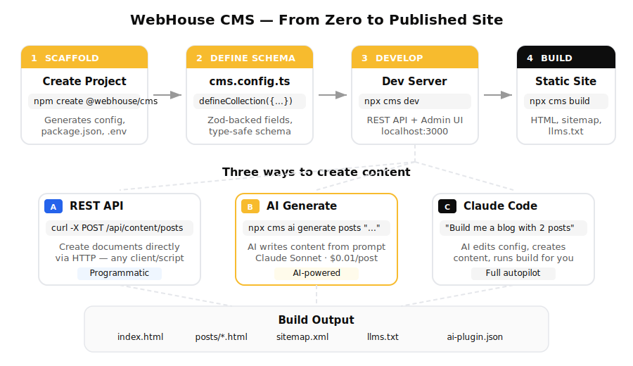

# @webhouse/cms-cli

CLI for [@webhouse/cms](https://github.com/webhousecode/cms) — scaffold projects, run the dev server, build static sites, and generate content with AI.

## Quick start

```bash
# 1. Create a new project
npm create @webhouse/cms my-site
cd my-site
npm install

# 2. Add your AI key (optional, for AI content generation)
echo "ANTHROPIC_API_KEY=sk-ant-..." >> .env

# 3. Start developing
npx cms dev
```

Your site is running at `http://localhost:3000` with a full REST API.

## The full workflow

Here's what a typical workflow looks like — from zero to published site:

<p align="center">
  
</p>

### Step 1: Scaffold

```bash
npm create @webhouse/cms my-site
cd my-site && npm install
```

This creates `cms.config.ts` with a `posts` collection, an example post, and a `.env` file for your API keys.

### Step 2: Define your schema

Edit `cms.config.ts` to add collections:

```typescript
import { defineConfig, defineCollection } from '@webhouse/cms';

export default defineConfig({
  collections: [
    defineCollection({
      name: 'posts',
      label: 'Blog Posts',
      fields: [
        { name: 'title', type: 'text', label: 'Title', required: true },
        { name: 'excerpt', type: 'textarea', label: 'Excerpt' },
        { name: 'content', type: 'richtext', label: 'Content' },
        { name: 'date', type: 'date', label: 'Publish Date' },
      ],
    }),
    defineCollection({
      name: 'pages',
      label: 'Pages',
      fields: [
        { name: 'title', type: 'text', label: 'Title', required: true },
        { name: 'body', type: 'richtext', label: 'Body' },
        { name: 'slug', type: 'text', label: 'URL Slug', required: true },
      ],
    }),
  ],
});
```

### Step 3: Create content

You have three ways to create content:

**A) Via the REST API** (programmatic)
```bash
curl -X POST http://localhost:3000/api/content/posts \
  -H "Content-Type: application/json" \
  -d '{"slug":"my-post","status":"published","data":{"title":"My Post","content":"# Hello"}}'
```

**B) Via AI generation** (from terminal)
```bash
npx cms ai generate posts "Write a blog post about TypeScript best practices"
```

**C) Via Claude Code** (AI-assisted development)
```
> Build a website with 2 collections (posts, pages). Create a post about
  why SQLite is great for content management.
```

Claude Code will edit `cms.config.ts`, call the API to create content, and verify the build.

### Step 4: Build & deploy

```bash
npx cms build    # Generates static HTML, sitemap, llms.txt
```

Output goes to `dist/` — deploy anywhere (Fly.io, Vercel, Cloudflare Pages, etc.)

## Using with Claude Code

WebHouse CMS is designed to work seamlessly with AI coding assistants. Here's a real-world session:

```
You:    Build a website around @webhouse/cms with 2 collections: posts and pages

Claude: I'll set up the project for you.
        [edits cms.config.ts — adds posts and pages collections]
        [starts dev server]
        [creates an "About" page via the API]
        ✓ Site running at http://localhost:3000

You:    Create a blog post about AI-native CMS

Claude: I'll use the AI content generator.
        [runs: npx cms ai generate posts "Write about AI-native CMS"]
        ✓ Created: why-ai-native-cms-is-the-future
          Cost: $0.0096 | Tokens: 195 in / 602 out

You:    Build it

Claude: [runs: npx cms build]
        ✓ Build complete — 6 pages in dist/
```

## Commands

| Command | Description |
| --- | --- |
| `cms init [name]` | Scaffold a new project |
| `cms dev [--port 3000]` | Start dev server with hot reload |
| `cms build [--outDir dist]` | Build static site (HTML, sitemap, llms.txt) |
| `cms serve [--port 5000]` | Serve built site locally |
| `cms ai generate <collection> <prompt>` | Generate content with AI |
| `cms ai rewrite <collection/slug> <instruction>` | Rewrite existing content |
| `cms ai seo` | Run SEO optimization on all documents |
| `cms mcp keygen` | Generate MCP API key |
| `cms mcp test` | Test MCP server connection |
| `cms mcp status` | Check MCP server status |

## Environment variables

The CLI automatically loads `.env` from the current directory.

| Variable | Required | Description |
| --- | --- | --- |
| `ANTHROPIC_API_KEY` | For AI features | Anthropic Claude API key |
| `OPENAI_API_KEY` | For AI features | OpenAI API key (alternative to Anthropic) |

At least one AI key is required for `cms ai` commands. Anthropic is used by default when both are set.

## Installation

```bash
# Global install
npm install -g @webhouse/cms-cli

# Or use npx (no install needed)
npx @webhouse/cms-cli dev

# Or add to your project
npm install @webhouse/cms-cli
```

## Documentation

See the [main repository](https://github.com/webhousecode/cms) for full documentation.

## License

MIT
